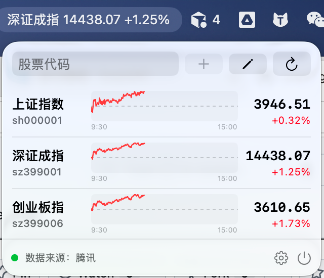
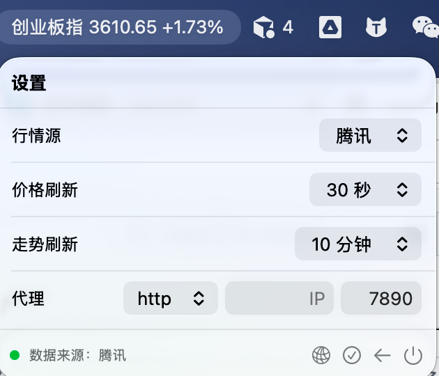

# AMBH

[](https://github.com/yueying0083/AllMoneyBackMyHome/actions/workflows/ci.yml)
[](https://github.com/yueying0083/AllMoneyBackMyHome/actions/workflows/release.yml)
[](https://github.com/yueying0083/AllMoneyBackMyHome/releases/latest)

AMBH（All Money Back My Home）是一个原生 macOS 菜单栏股票行情 App。它只驻留在菜单栏，不显示 Dock 图标，适合用较少的屏幕空间持续查看沪深股票和指数。




## 功能

- 菜单栏轮播股票简称、现价和涨跌幅
- 沪深 A 股及指数自选列表
- 行内展示真实当日分时走势，横轴固定为 `09:30–15:00`
- 支持股票别名、上下排序和删除
- 腾讯与新浪行情源切换及故障备用
- 价格刷新支持 `15 / 30 / 60 秒`
- 走势图独立缓存，支持 `5 / 10 分钟`刷新
- HTTP、HTTPS、SOCKS5、SOCKS5H 手动代理
- 退出后保留自选、设置、价格和当日走势图缓存



## 系统要求

- macOS 13 或更高版本
- Swift 6 工具链，推荐安装完整 Xcode
- 构建时链接 macOS 系统 `libcurl`

## 下载

从 [GitHub Releases](https://github.com/yueying0083/AllMoneyBackMyHome/releases/latest) 下载 Apple Silicon（arm64）ZIP，解压后打开 `AMBH.app`。

Release 附件同时提供 SHA-256 校验文件。当前发布包使用 ad-hoc 签名，未进行 Apple 公证；首次运行若被 Gatekeeper 阻止，可在“系统设置 > 隐私与安全性”中确认打开。

## 构建与运行

```bash
./scripts/test-direct.sh
./scripts/build-app.sh
open dist/AMBH.app
```

构建产物位于 `dist/AMBH.app`。脚本会为本机运行执行 ad-hoc 签名；未进行 Developer ID 签名或 Apple 公证，不适合直接作为公开发行包分发。

生成与 GitHub Release 相同格式的 ZIP：

```bash
./scripts/package-release.sh v1.0.1
```

仓库同时保留标准 Swift Package 配置。安装状态正常的 Xcode/SwiftPM 环境可运行：

```bash
swift test
swift build -c release
```

当前网络允许访问行情接口时，可以执行真实接口烟雾测试：

```bash
./scripts/smoke-live.sh
./scripts/smoke-concurrent.sh
```

## 使用

1. 启动 App 后，菜单栏会显示当前轮播股票的名称、价格和涨跌幅。
2. 点击菜单栏价格打开自选列表。
3. 输入六位证券代码添加股票；需要显式指定市场时可使用 `sh` 或 `sz` 前缀。
4. 点击铅笔图标设置别名、调整顺序或删除股票。
5. 点击底部齿轮进入设置。

首次运行默认加入上证指数 `sh000001` 和深证成指 `sz399001`。

## 刷新规则

- 启动时主动获取价格与走势图。
- 沪深交易时段内，价格和走势图按各自设置的频率独立刷新。
- 午休、收盘后和周末停止周期刷新，仍可手动刷新价格。
- 走势图使用当天持久化缓存；后台更新时继续展示已有曲线，不会反复进入加载状态。
- 当前未接入法定节假日交易日历。

## 代理

设置页可填写代理协议、IP/主机和端口：

- IP/主机为空：直连
- IP/主机非空：启用所填代理
- 支持 `http`、`https`、`socks5`、`socks5h`
- `socks5` 在本机解析目标域名，`socks5h` 由代理解析域名
- 代理连接失败时不会绕过代理自动直连

代理配置会同时应用于腾讯、新浪行情和腾讯分时请求。首版不支持代理用户名和密码认证。

## 项目结构

```text
Sources/AMBH/          SwiftUI 菜单栏界面和应用状态
Sources/AMBHCore/      行情、分时、缓存、代理和刷新逻辑
Sources/CCurlShim/     系统 libcurl 的 C 桥接
Tests/AMBHCoreTests/   XCTest 测试
DirectTests/           无 SwiftPM 时使用的直接测试和烟雾测试
scripts/               测试与 App bundle 构建脚本
```

## 数据源说明

腾讯和新浪接口属于非正式免费行情接口，可能发生字段变更、限流或停止服务。本项目提供双源容错和本地缓存，但不保证实时性、准确性或长期可用性，也不构成任何投资建议。
